# Knowledge Lab · 自测学习平台

> RAG-powered self-test learning platform with Obsidian + LLM + Whisper
> 基于 Obsidian + LLM + Whisper 的 RAG 自测学习系统

[](https://www.python.org/)
[](LICENSE)
[](https://flask.palletsprojects.com/)
[](https://github.com/baiwanwan1224-hub/Knowledge-Lab/actions)
[]()

---

## Screenshots · 界面预览

### Dashboard · 仪表盘

| 全景 | 下半部分 |
|:---:|:---:|
| 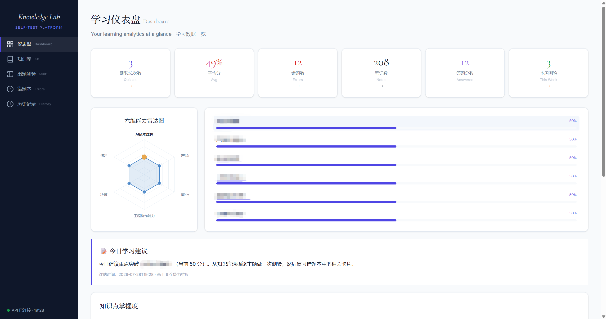 | 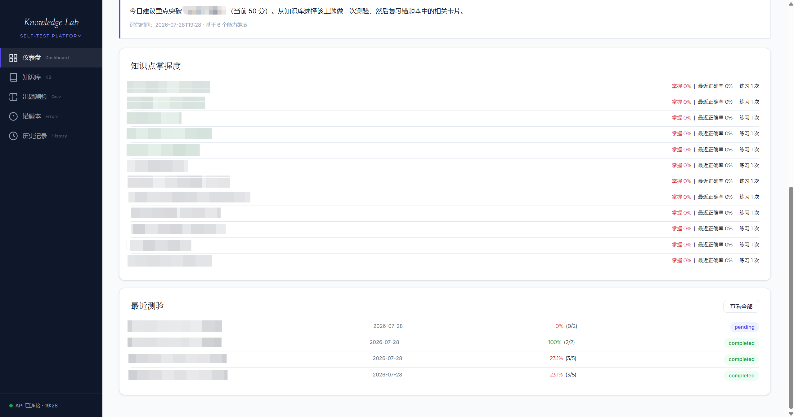 |

### Knowledge Base · 知识库

| 笔记列表 | 粘贴文本导入 |
|:---:|:---:|
| 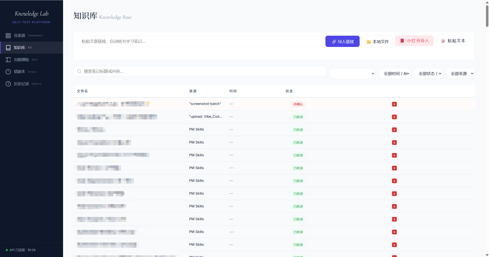 | 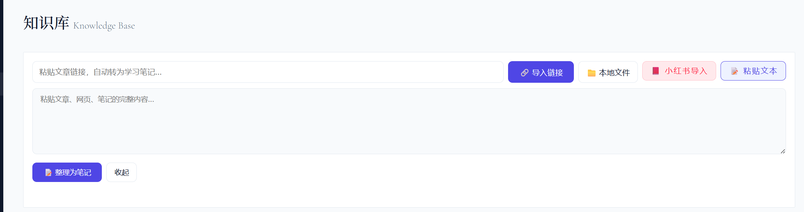 |

| 笔记详情展示 |
|:---:|
| 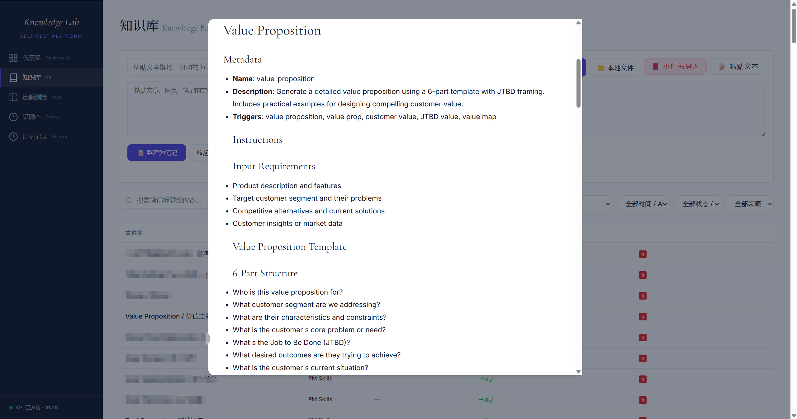 |

### Quiz · 出题测验

| 选题界面 | 答题界面 |
|:---:|:---:|
| 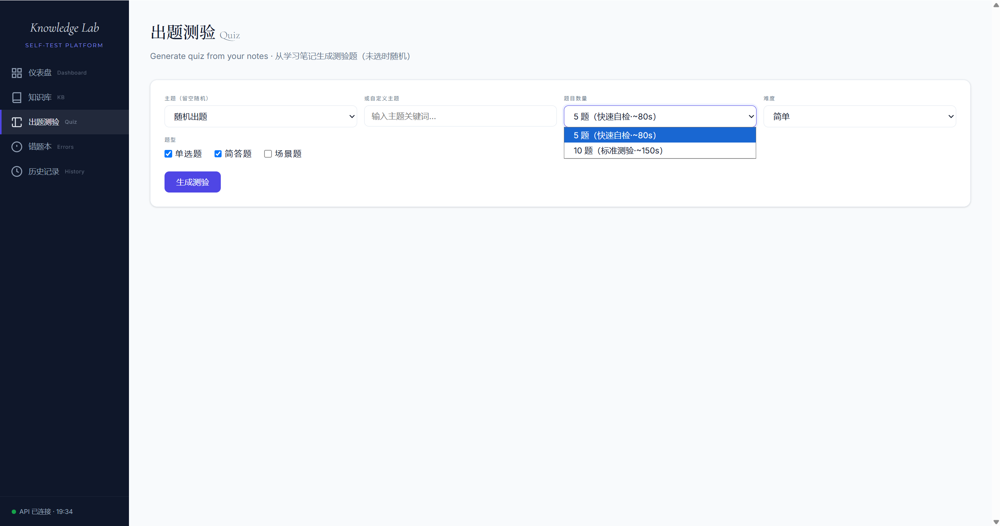 | 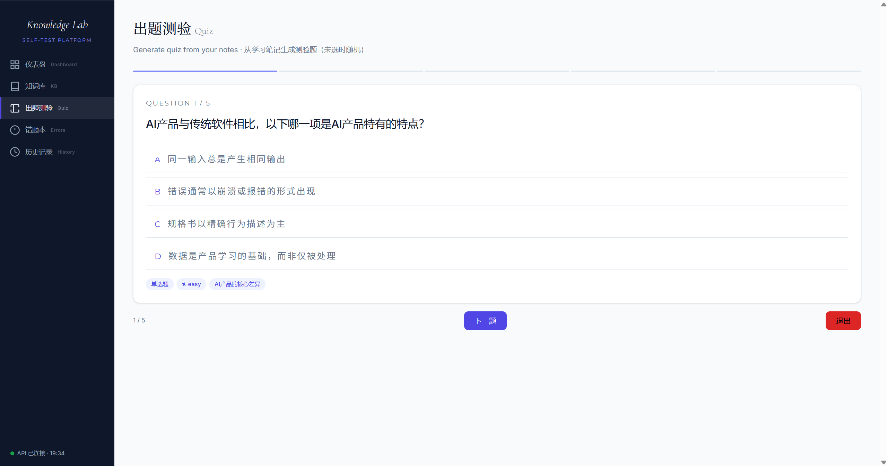 |

### Grading · 批改结果

| 得分总览 | 逐题回顾（上） |
|:---:|:---:|
| 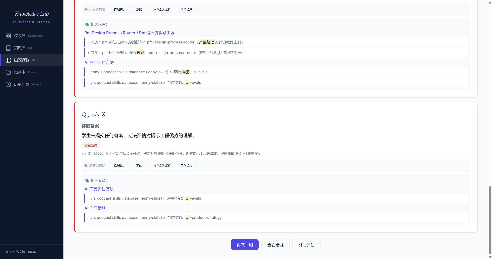 | 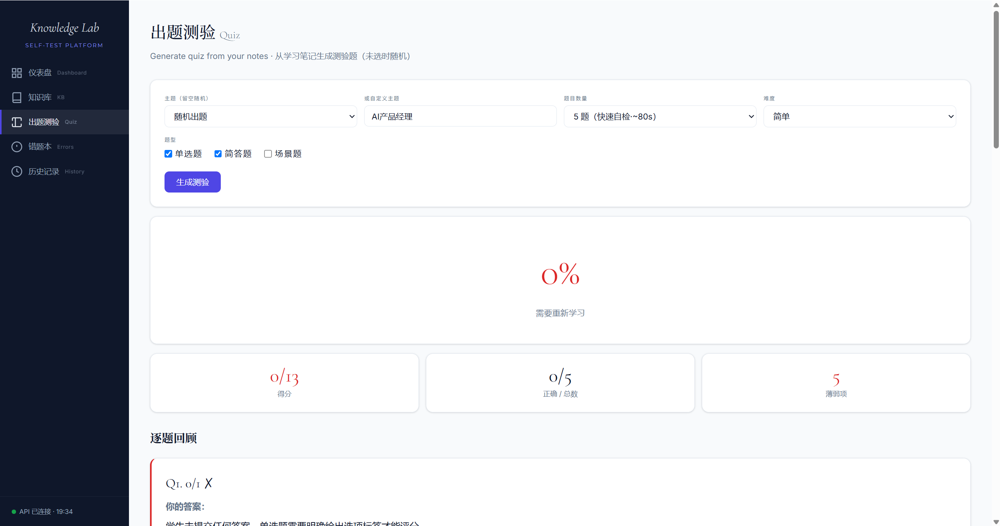 |

| 逐题回顾（下） |
|:---:|
| 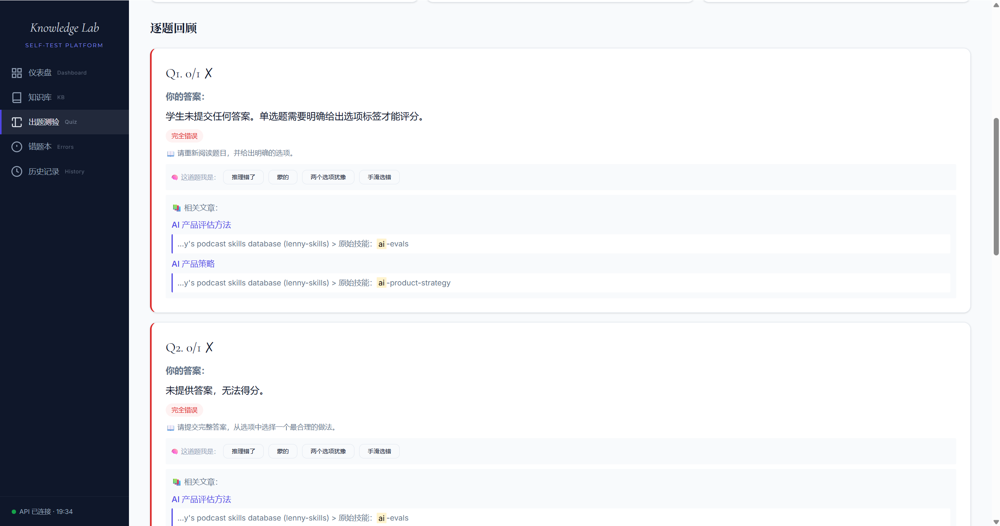 |
| 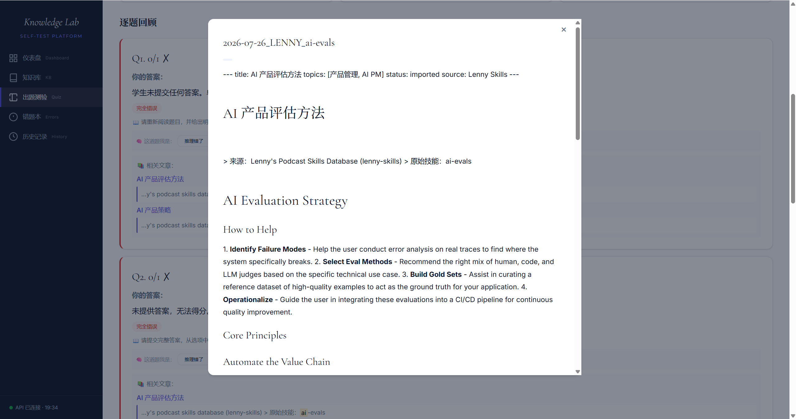 |

### Wrong Answers · 错题本

| 错题复习列表 |
|:---:|
| 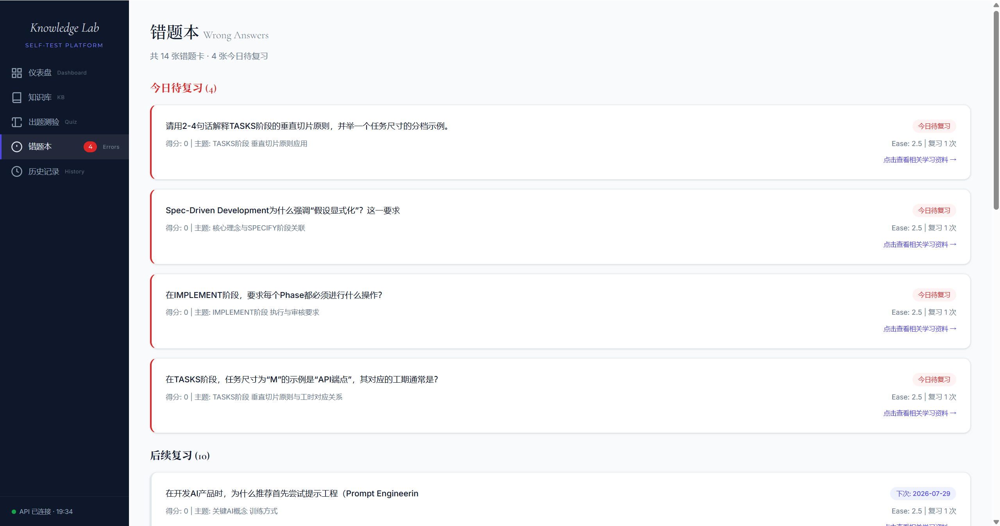 |

### History · 历史记录

| 测验记录列表 |
|:---:|
| 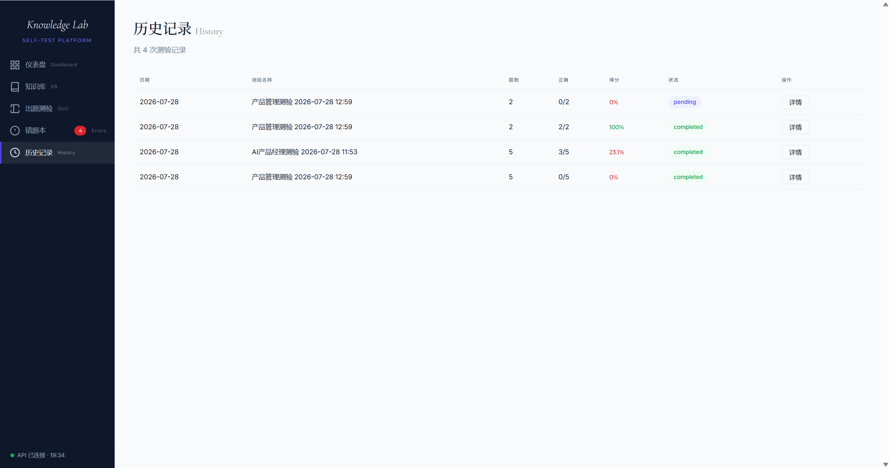 |

---

## Architecture · 架构

```
apps/web/ (纯 HTML SPA)          server/ (Flask + Blueprint)
─────────────────────────        ────────────────────────────
dashboard_v2.html                app.py (Flask 入口)
  ↓ fetch('/v1/...')             ├── blueprints/
  HTTP/JSON                      │   ├── quiz.py   /quiz/*
                                 │   ├── notes.py  /notes/*
                                 │   └── web.py    /
                                 ├── cache.py (SQLite 缓存)
                                 ├── stats.py (LLM 调用统计)
                                 ├── quiz_generator.py (RAG 出题)
                                 ├── quiz_grader.py (LLM 评分 + SM-2)
                                 └── vault_core.py (原子写入 + WAL)
```

**前后端分离**：前端纯静态 HTML（零依赖，可独立部署）· 后端 Flask REST API（`/v1/*` 端点）· Swagger 文档（`/apidocs`）

---

## Features · 功能

| 功能 | 说明 |
|------|------|
| 📥 **内容导入** | URL / YouTube / 粘贴文本 → LLM 自动结构化 → Markdown 笔记 |
| 🧪 **自动出题** | 扫描 Obsidian Vault → RAG 组装 Prompt → LLM 生成题目 → QA 门禁 |
| 📝 **智能评分** | LLM 批改答案 → SM-2 间隔重复 → 错题自动入队 |
| 📊 **能力雷达** | 六维能力评估（AI技术/评测/数据/产品/商业/工程） |
| 🎙️ **语音输入** | YouTube 字幕提取 + faster-whisper 转录 |
| ⚡ **响应缓存** | SQLite 缓存同题结果，命中延迟 < 50ms（提速 195x） |
| 📈 **调用统计** | `/v1/stats` 查看 LLM 调用次数/延迟/Token/缓存命中率 |

---

## Quick Start · 快速开始

### Windows
```bash
git clone https://github.com/baiwanwan1224-hub/Knowledge-Lab.git
cd Knowledge-Lab
copy .env.example .env          # 编辑 .env，填入 DeepSeek API Key
start.bat                       # 自动安装依赖 + 启动服务
```
打开浏览器访问 http://localhost:5050

### Mac / Linux
```bash
git clone https://github.com/baiwanwan1224-hub/Knowledge-Lab.git
cd Knowledge-Lab
cp .env.example .env            # 编辑 .env，填入 DeepSeek API Key
bash start.sh                   # 自动安装依赖 + 启动服务
```

### 详细配置
遇到问题？→ [完整配置指南](docs/SETUP.md)（API Key 获取、常见问题、Vault 模式、功能导览）

### API 文档
启动后访问 http://localhost:5050/apidocs 查看 Swagger UI

---

## Tech Stack · 技术栈

| 层 | 技术 | 说明 |
|------|------|------|
| 前端 | 纯 HTML/CSS/JS | 零框架，零构建步骤 |
| 后端 | Python Flask 3.0+ | Blueprint 模块化 + pydantic 验证 |
| AI | DeepSeek V4 Pro | 出题/评分/结构化（可切换 GLM-4/GPT-4.1/MiniMax M3） |
| 存储 | JSON 文件（默认） | PostgreSQL 可选 |
| 语音 | faster-whisper (tiny) + yt-dlp | 本地 CPU 推理 |
| 缓存 | SQLite | 30 天 TTL，model_version 自动失效 |

---

## Project Structure · 项目结构

```
knowledge-lab/
├── apps/web/           ← 前端 SPA
├── server/             ← Flask API 后端
│   ├── blueprints/     ← quiz / notes / web 路由
│   ├── middleware/     ← API Key 认证
│   ├── cache.py        ← LLM 响应缓存
│   └── stats.py        ← 调用统计
├── skills/             ← AI 协作技能（7 个）
├── tests/              ← 32 个 pytest 用例
├── standards/          ← L0 不可变标准
├── spec/               ← 产品文档 + 方案文档
├── docs/               ← 技术文档 + 截图
├── templates/          ← Obsidian 笔记模板
└── vault/              ← 本地知识库
```

---

## LLM Provider · 模型切换

| 模型 | 设置 `LLM_PROVIDER=` | 适用场景 |
|------|---------------------|------|
| DeepSeek V4 Pro | `deepseek`（默认） | 日常出题 · 综合最优 |
| DeepSeek V4 Flash | `deepseek-flash` | 批量出题 · 速度优先 |
| GLM-4 | `zhipu` | 中文内容 · 成本最低 |
| GPT-4.1 | `openai` | 英文内容 · 质量最高 |
| Ollama (本地) | `ollama` | 离线使用 · 零成本 |

> ⚠️ **截图 OCR 需要多模态模型**：出题和批改只需文本 API。截图录入功能需要支持图片理解的多模态 LLM，在 `.env` 中配置相应 API Key 即可启用。不填则 OCR 功能不可用，不影响其他功能。

---

## L0 Standards · 不可变标准

| ID | 名称 | 内容 |
|----|------|------|
| L0-001 | 评分标准 | 单选 0/1 · 简答/场景 0-5 · ≥70% 及格 · SM-2 |
| L0-002 | 能力维度 | 6 维雷达图（AI/评测/数据/产品/商业/工程） |
| L0-003 | 内容质量 | 5 项入库检查 + QA 门禁 |
| L0-004 | 命名规范 | 文件名 `YYYYMMDD_{主题}_{来源}.md` |

---

## License · 许可

AGPL v3.0 — 详见 [LICENSE](LICENSE)

Commercial use requires a separate license. Contact: baiwanwan1224@gmail.com

---

[](https://github.com/baiwanwan1224-hub/Knowledge-Lab/releases)

Built with [Claude Code](https://claude.ai/code) · 2026
