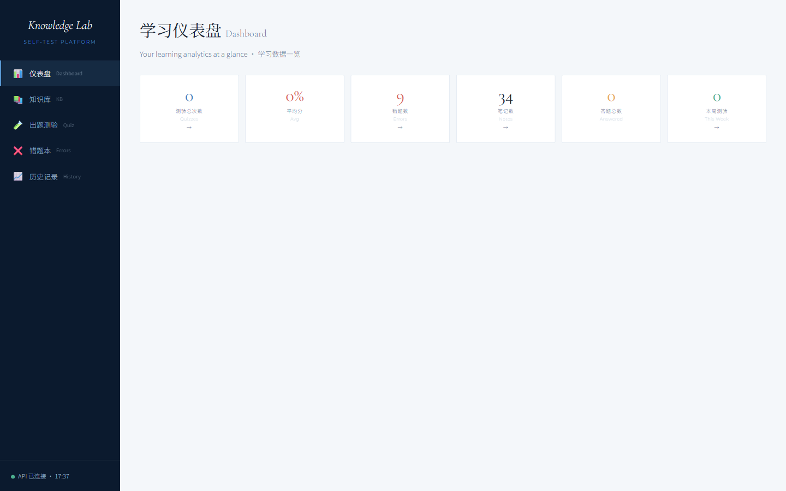
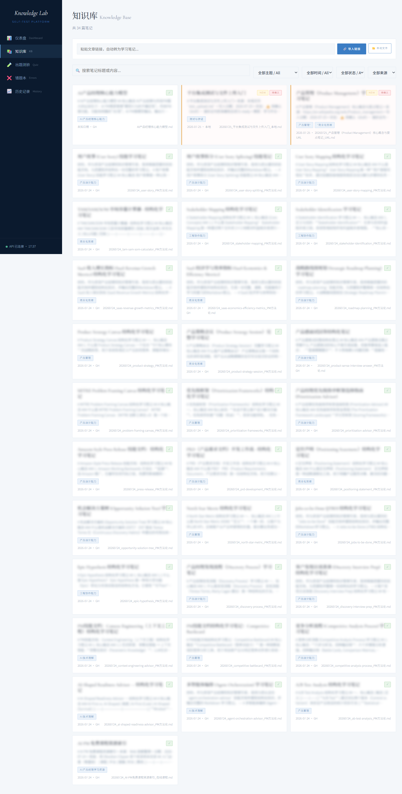
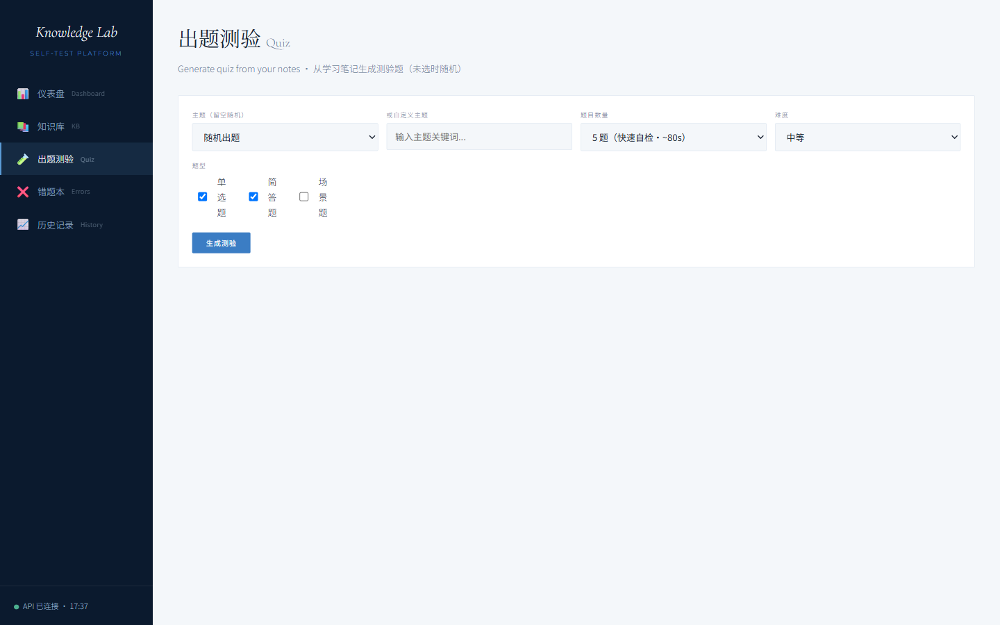
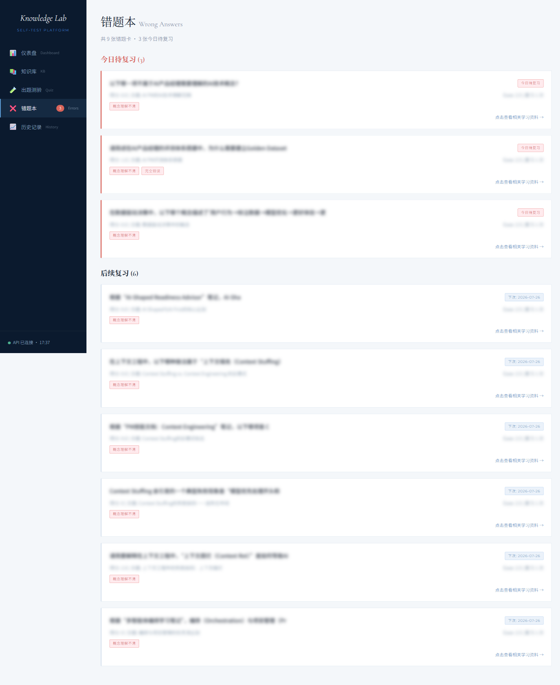

# Knowledge Lab · 自测学习平台

> RAG-powered self-test learning platform with Obsidian + LLM + Whisper  
> 基于 Obsidian + LLM + Whisper 的 RAG 自测学习系统

[](LICENSE)

---

## Screenshots · 界面预览

| Dashboard · 仪表盘 | Knowledge Base · 知识库 |
|:---:|:---:|
|  |  |

| Quiz · 出题测验 | Wrong Answers · 错题本 |
|:---:|:---:|
|  |  |

---

## Architecture · 架构

```
┌── Dashboard HTML ──┬── quiz_server.py (API) ──┬── quiz_generator.py
│  (SPA, no framework)│                           │   Read Obsidian notes
│  📊 Dashboard       │  POST /quiz/generate      │   → DeepSeek generates
│  📚 Knowledge Base  │  POST /quiz/grade          │   → QA validation
│  🧪 Quiz            │  POST /notes/import        │
│  ❌ Wrong Answers   │  POST /notes/upload        ├── quiz_grader.py
│  📈 History         │  POST /notes/transcribe    │   Load grading rubric
│                     │  POST /notes/verify        │   → DeepSeek scores
│                     │  DELETE /notes             │   → SM-2 scheduling
│                     │  GET  /competency          │   → Wrong-answer cards
│                     │  GET  /dashboard           │
│                     │  GET  /history             └──────────────────────────┘
└─────────────────────┴──────────────────────────────────────────────────────┘
```

## Tech Stack · 技术栈

| Layer · 层 | Technology · 技术 |
|:---|:---|
| Frontend · 前端 | Vanilla HTML/CSS/JS (SPA, zero dependencies) |
| Backend · 后端 | Python HTTP Server (stdlib) |
| AI Engine · AI引擎 | DeepSeek v4-pro (quiz generation + grading + note import) |
| Speech-to-Text · 语音识别 | faster-whisper (tiny) + yt-dlp |
| Database · 数据库 | PostgreSQL (optional, file-mode fallback) |
| Knowledge Base · 知识库 | Obsidian vault (Markdown + YAML frontmatter) |
| Standards · 标准体系 | L0 immutable standards (rubric / competency / quality / naming) |

## Quick Start · 快速开始

### 1. Install · 安装依赖

```bash
pip install -r requirements.txt
```

### 2. Configure · 配置环境变量

```bash
export DEEPSEEK_API_KEY="sk-your-key"
export PG_HOST="localhost"
export PG_PORT="5432"
export PG_DATABASE="n8n_scraper"
export PG_USER="n8n"
export PG_PASSWORD="your-password"
export VAULT_PATH="/path/to/ObsidianVault/AI-PM-学习"
```

### 3. Init DB · 初始化数据库 (optional · 可选)

```bash
psql -h $PG_HOST -U $PG_USER -d $PG_DATABASE -f sql/schema.sql
```

### 4. Start · 启动

```bash
python server/quiz_server.py --port 5050
```

Open `http://localhost:5050` in browser · 浏览器打开

## Features · 功能

### Six-Dimensional Competency Assessment · 六维能力评估

| Dimension · 维度 | Definition · 定义 |
|:---|:---|
| AI技术理解 · AI Technical Understanding | LLM / RAG / Agent / Prompt principles |
| 评测体系搭建 · Evaluation System | Rubric design + Golden Set + LLM-as-Judge |
| 数据驱动决策 · Data-Driven Decision | Metrics + A/B testing + Data flywheel |
| 产品设计能力 · Product Design | 0→1 full product lifecycle |
| 商业化思维 · Business Thinking | Pricing / Market / TAM / ROI |
| 工程协作能力 · Engineering Collaboration | PRD / OKR / Tech review / Cross-team |

### Content Quality Flow · 内容质量保障

```
URL/File import → status: draft → manual /notes/verify → status: ready → quiz-ready
```

- `draft` notes are excluded from quiz generation
- `ready` notes are quiz-eligible
- L0 standards define scoring rubric, competency dimensions, content quality checklist

### Video Import · 视频导入

```
YouTube → has captions? → youtube-transcript-api
        → no captions?  → yt-dlp download audio → faster-whisper transcription
        → no captions & no description → blocked (no empty notes created)
```

## Project Structure · 项目结构

```
knowledge-lab/
├── server/
│   ├── quiz_server.py        # API server (HTTP + standards loading)
│   ├── quiz_generator.py     # RAG quiz generation
│   └── quiz_grader.py        # LLM grading + SM-2 + wrong-answer cards
├── dashboard/
│   └── dashboard_v2.html     # Unified dashboard SPA
├── standards/                # L0 immutable standards
├── sql/
│   └── schema.sql            # PostgreSQL DDL
├── templates/                # Obsidian note templates
└── docs/images/              # Screenshots
```

## License · 许可

This project is licensed under the **GNU Affero General Public License v3.0 (AGPL-3.0)**.

**Commercial Use · 商用许可**: A separate commercial license is required for any commercial use (internal business deployment, SaaS, embedding in commercial products).

Contact · 联系: baiwanwan1224@gmail.com

---

Built by [@baiwanwan1224-hub](https://github.com/baiwanwan1224-hub) · 2026
