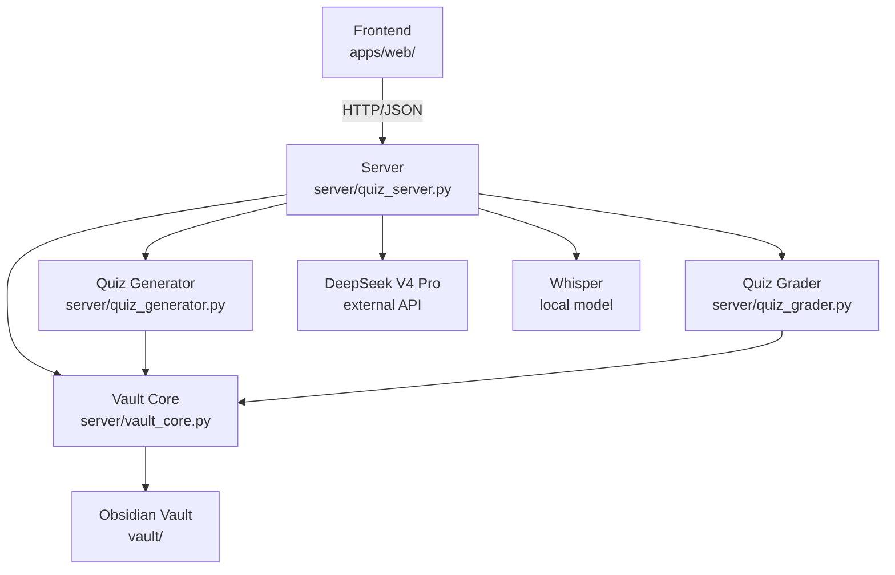
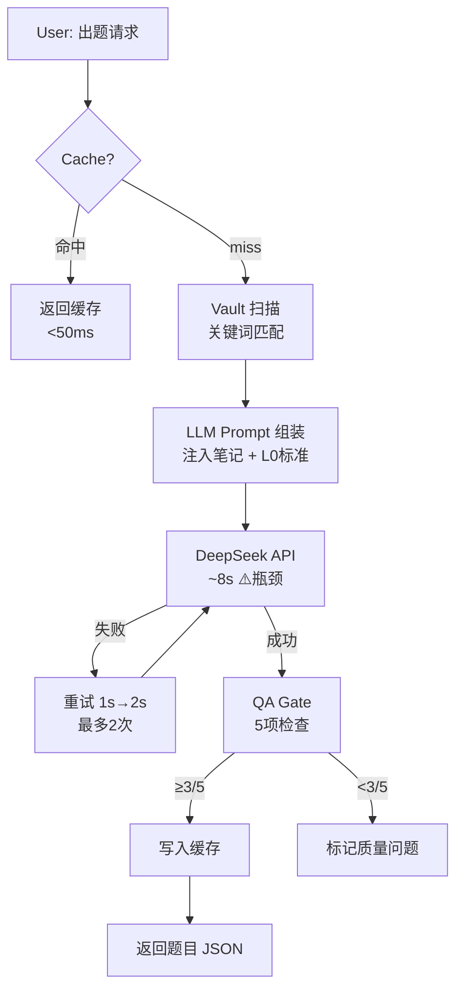
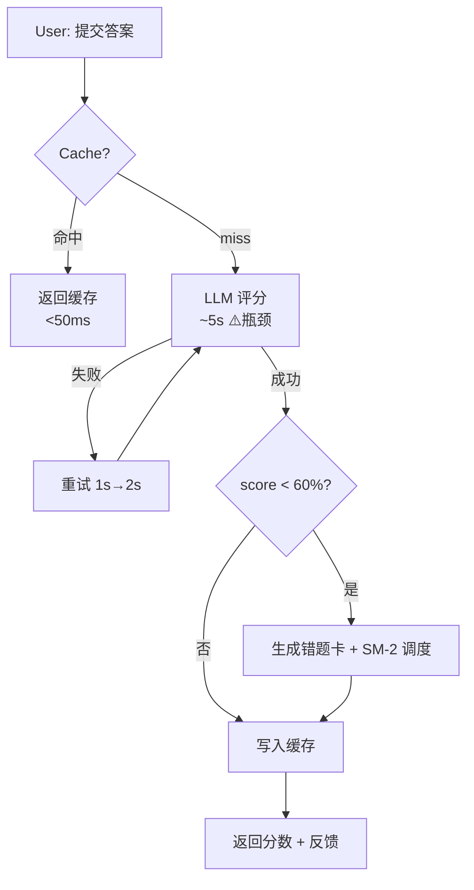
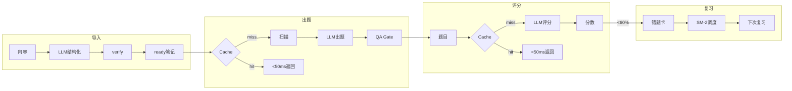

# Knowledge Lab · System Architecture

> Target audience: Developers & AI Agents (Claude Code) · ~1.5 pages

---

## 1. Overview

Knowledge Lab is a **RAG-powered self-test learning platform** using Obsidian vault as the knowledge base, LLM for quiz generation & grading, and Whisper for video transcription.

**Tech Stack**: Python 3.10+ · `http.server` (stdlib, no framework) · DeepSeek V4 Pro (default LLM) · faster-whisper (tiny) · yt-dlp · Pure HTML/CSS/JS frontend (zero dependencies)

**Boundaries**: Single-user local tool · No authentication · No user data persistence beyond local vault · Not exposed to public internet

**References**: `standards/_STANDARD_评分标准.md` (L0-001) · `standards/_STANDARD_能力维度.md` (L0-002) · `standards/_STANDARD_内容质量.md` (L0-003)

---

## 2. Module Architecture

| Module | Responsibility | Code Location |
|--------|---------------|---------------|
| **Frontend** | SPA dashboard — quiz, knowledge base, wrong answers, history | `apps/web/dashboard_v2.html` |
| **HTTP Server** | Route dispatch + request handling + standards loading | `server/quiz_server.py` |
| **Quiz Generator** | RAG-based quiz generation via LLM | `server/quiz_generator.py` |
| **Quiz Grader** | LLM grading + SM-2 spaced repetition + wrong-answer cards | `server/quiz_grader.py` |
| **Vault Core** | Atomic writes + WAL + integrity checks | `server/vault_core.py` |
| **External** | Obsidian vault (file system) + Whisper (audio) + yt-dlp (video) | `vault/` (local) |

### Dependency Graph



Dependencies are strictly top-down. Frontend never accesses vault directly.

---

## 3. Pipeline · Core Data Flow

### 3.1 内容导入链路

| Step | 动作 | 输入 | 输出 | 耗时 | 缓存 |
|------|------|------|------|:--:|:--:|
| 1 | 内容获取 | URL / YouTube链接 / 粘贴文本 | 原始内容 | < 2s | — |
| 2 | LLM 结构化 | 原始内容 | Markdown 笔记（含 frontmatter） | ~5s | ❌ |
| 3 | 人工 verify | draft 笔记 | ready 笔记 | 人工 | — |

> 关键设计：LLM 在解析阶段就完成结构化，产出的是语义完整的 Markdown 笔记。这等价于把「切分 + 摘要」前置，省去了后续 chunking/embedding。

### 3.2 出题链路（核心 RAG）



| Step | 动作 | 输入 | 输出 | 耗时 | 瓶颈？ |
|------|------|------|------|:--:|:--:|
| 1 | Vault 扫描 | topic + 笔记目录 | 匹配的笔记列表 | < 50ms | ❌ |
| 2 | Prompt 组装 | 笔记内容 + L0标准 | LLM prompt | < 10ms | ❌ |
| 3 | LLM 生成 | prompt | 题目 JSON | **~8s** | ⚠️ **99%耗时** |
| 4 | QA Gate | 题目 JSON | 质量分 + 问题标记 | < 10ms | ❌ |
| 5 | 缓存写入 | 题目 + 参数哈希 | SQLite 记录 | < 10ms | ❌ |

> 缓存命中时跳过 Step 2-5，直接从 SQLite 返回，延迟 < 50ms（提速 **195 倍**）。

### 3.3 评分链路



| Step | 动作 | 输入 | 输出 | 耗时 |
|------|------|------|------|:--:|
| 1 | LLM 评分 | 题目 + 用户答案 + 标准答案 | score + feedback + weakness_tags | **~5s** ⚠️ |
| 2 | SM-2 判断 | score, max_score | is_wrong, next_review_date | < 1ms |
| 3 | 错题卡生成 | 题目 + 错误答案 + 反馈 | Obsidian .md 文件 | < 10ms |
| 4 | 缓存写入 | 评分结果 + 参数哈希 | SQLite 记录 | < 10ms |

### 3.4 错题复习链路（SM-2）

```
得分 < 60%
  → 生成错题卡（Markdown + frontmatter）
  → SM-2 计算下次复习日期：
      首次错误 → 1天后
      二次错误 → 6天后
      多次错误 → interval × ease_factor
  → ease_factor 动态调整（1.3 ~ 2.5）
  → 连续 3 次 ≥ 90% → 标记"已掌握"
```

### 3.5 全链路总览



### 3.6 性能瓶颈与优化

| 瓶颈 | 位置 | 耗时 | 优化 | 状态 |
|------|------|:--:|------|:--:|
| LLM 调用 | quiz_generator / quiz_grader | 3-12s | SQLite 缓存（同题不重复调 API） | ✅ P1 |
| 调用失败 | 网络/API 限流 | — | 指数退避重试（1s→2s，最多2次） | ✅ P0 |
| 不可观测 | — | — | stats.py 记录每次调用的延迟/token | ✅ P0 |
| 文件 I/O | vault 扫描 | < 50ms | vault < 1000 篇时不是瓶颈 | ⏸️ |
| 并发 | 单用户 | N/A | 不需要 | 🚫 |

---

## 4. Frontend-Backend Separation

| Layer | Technology | Location | Deployment |
|-------|-----------|----------|------------|
| Frontend | Pure HTML/CSS/JS SPA | `apps/web/` | Static file, served by Python HTTP server |
| Backend | Python stdlib HTTP server | `server/` | Single process, port 5050 |
| API Protocol | HTTP + JSON | — | CORS enabled (`Access-Control-Allow-Origin: *`) |

Frontend communicates with backend exclusively through REST API calls (`fetch()`). No server-side rendering. Frontend can be deployed independently (e.g., to CDN) if needed.

---

## 5. Data Flow · Request Lifecycle

**Typical quiz generation request:**

```
User clicks "Generate Quiz"
  → Frontend: POST /quiz/generate {topic, count, types}
  → Server: quiz_server.py → spawns quiz_generator.py as subprocess
  → Quiz Generator: scans vault → builds LLM prompt → calls DeepSeek API
  → LLM: returns JSON with questions
  → QA Gate: validates 5 checks → returns questions + quality scores
  → Frontend: renders quiz UI
```

**3 data transformation points:**
1. Vault Markdown → Python dict (frontmatter parsing)
2. Python dict → LLM prompt string (RAG context assembly)
3. LLM JSON response → validated quiz object (parse + QA check)

---

## 6. Key Design Decisions

| Decision | Rationale |
|----------|-----------|
| **Obsidian vault as storage** | User-owned data, Markdown-native, no database dependency, bi-directional sync |
| **Python stdlib HTTP server** | Zero external dependencies, easy to audit, fast startup. No Flask/FastAPI overhead. |
| **Pure HTML frontend (no build step)** | Lowest maintenance cost. AI agents (Claude Code) can edit single file without build toolchain. |
| **No authentication** | Single-user local tool. Not exposed to public internet. Auth would add complexity without security benefit. |
| **LLM as universal engine** | Same model handles quiz generation, grading, note structuring, and content extraction. Single integration point. |
| **JSON file storage (PostgreSQL optional)** | Default: lightweight, zero config. PostgreSQL available for multi-user or analytics use cases. |

---

## 7. Observability · 可观测性

> Added 2026-07-27 · P0 Pipeline monitoring

### 7.1 Pipeline Latency Logging
Each LLM call point logs: endpoint, topic, latency_ms, retries, token_usage.
Format: `[Pipeline] quiz.generate topic=AI产品策略 latency=8234ms retries=0`

### 7.2 Call Statistics (SQLite)
`server/stats.py` records every LLM call to `data/stats.db`:
- endpoint, model, tokens (prompt/completion/total), latency_ms, retries, cache_hit, error
- `GET /v1/stats` returns 7-day summary grouped by endpoint

### 7.3 Retry Mechanism
LLM calls retry on timeout/5xx: 1s → 2s (max 2 retries, 3 total attempts).
Logged: `[WARNING] LLM generate failed → retry 1/2, reason: timeout`

### 7.4 Response Cache (P1)
`server/cache.py` — SQLite-based, TTL 30 days, keyed by content hash + model_version.
Cached: quiz generation results, grading results.
Invalidation: model_version bump, explicit `cache.invalidate()`, 30-day TTL.

---

## 8. Failure Modes

Each failure mode uses a unified 3-field structure: **Code / Detector / Fallback**.

### 7.1 LLM API Error
- **Code**: `LLM_API_ERROR`
- **Detector**: `quiz_generator.py → call_llm()` / `quiz_grader.py → grade_answer()` — HTTP status ≠ 200
- **Fallback**: Return `{"error": "LLM_API_ERROR", "detail": "..."}` to frontend. User can retry.

### 7.2 No Notes Found for Topic
- **Code**: `NO_CONTENT`
- **Detector**: `quiz_generator.py → find_notes()` — empty result set
- **Fallback**: Return `{"status": "no_content", "error": "No notes found for topic"}`. Frontend shows suggestion to import notes first.

### 7.3 Vault Integrity Failure
- **Code**: `VAULT_INTEGRITY_FAIL`
- **Detector**: `vault_core.py → verify_integrity()` — SHA-256 mismatch on WAL replay
- **Fallback**: Log warning, continue with available files. Alert user to run manual integrity check.

### 7.4 Audio Transcription Failed
- **Code**: `TRANSCRIBE_FAILED`
- **Detector**: `quiz_server.py → _handle_transcribe()` — yt-dlp download fails OR whisper returns empty
- **Fallback**: Return `422` + prompt: "No captions available and transcription failed. Try pasting text directly."
